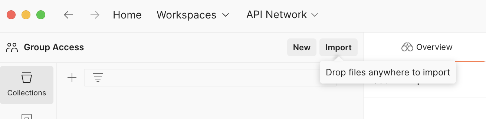
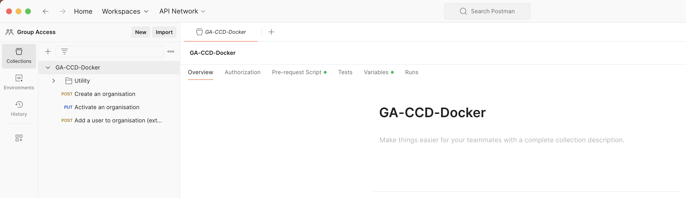

# Setup Postman for GA-CCD-Docker

## Pre-requisites

* [Postman](https://www.getpostman.com/downloads/)

## Import the Postman collection

* Open Postman
* Click on `Import` button (top left corner of the screen) (see image below)

* Click on `Choose Files` button
* Select the file `GA-CCD-Docker.postman_collection.json` from the `assets` folder.

You should now see the collection `GA-CCD-Docker` in the left hand side panel.
