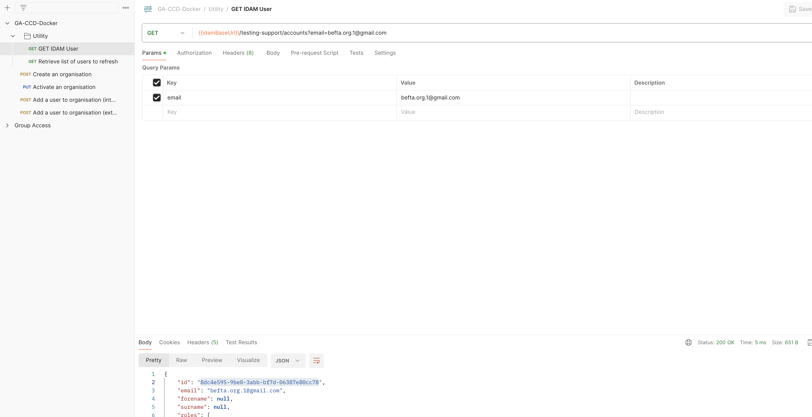
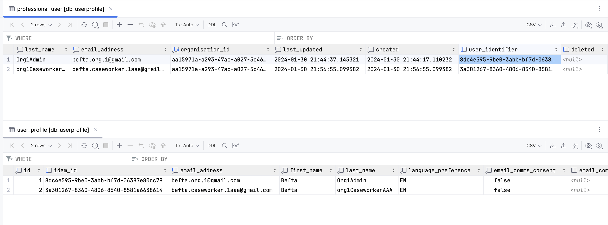

# Updating a User Identifier for a professional user

* Update the user identifer for a professional user to the one returned by the IDAM API.
* Update the user status to `ACTIVE`.

Use postman to get the user's IDAM ID from the IDAM API by email address. Use the request under the `Utility` folder.



Open a query editor for the `dbuserprofile` database and run the following SQL:

``` sql
update dbuserprofile.user_profile
set idam_id = '<IDAM_ID>', idam_status = 'ACTIVE'
where email_address = 'befta.org.1@gmail.com'
```

Open a query editor for the `dbrefdata` database and run the following SQL:

``` sql
update dbrefdata.professional_user
set user_identifier = '<IDAM_ID>'
where email_address = 'befta.org.1@gmail.com'
```


